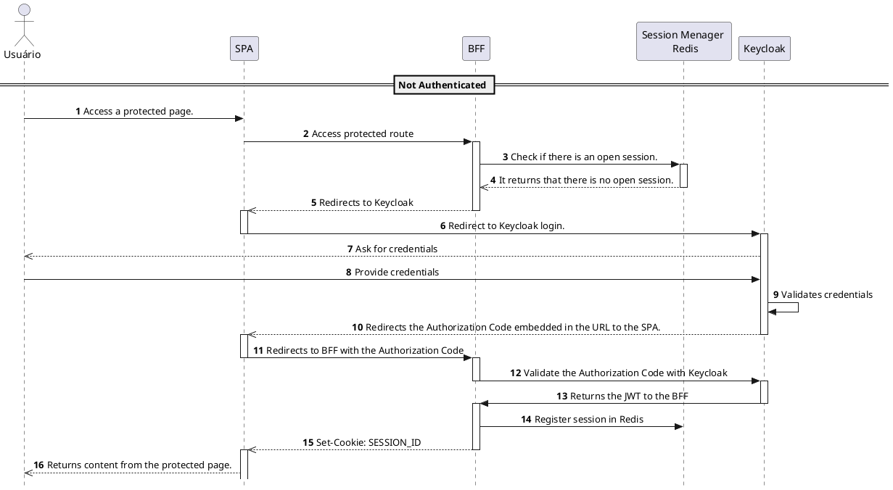
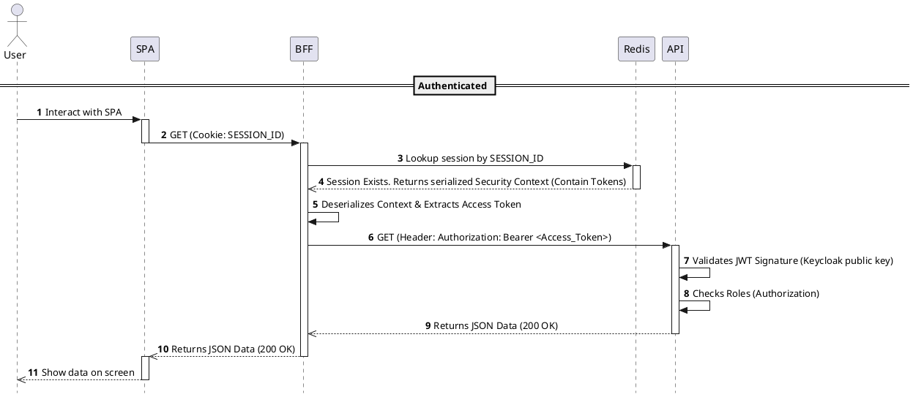
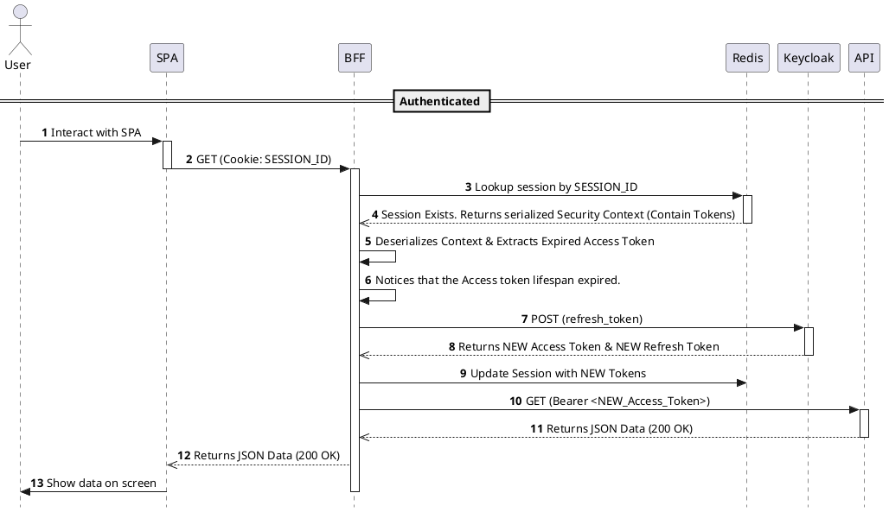
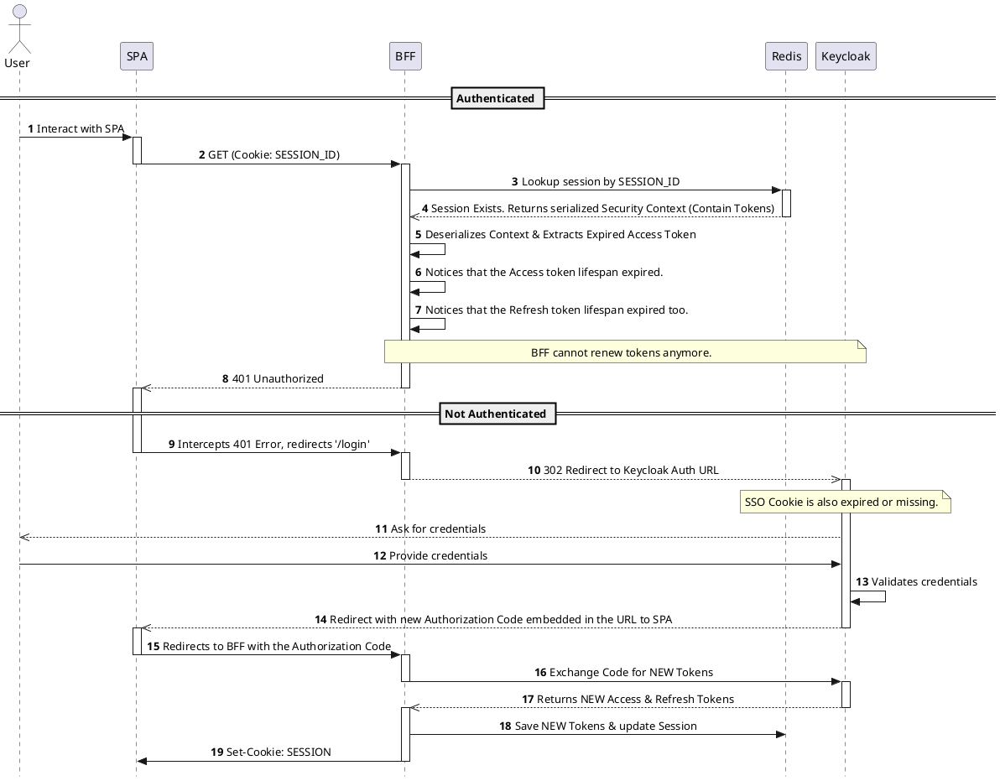
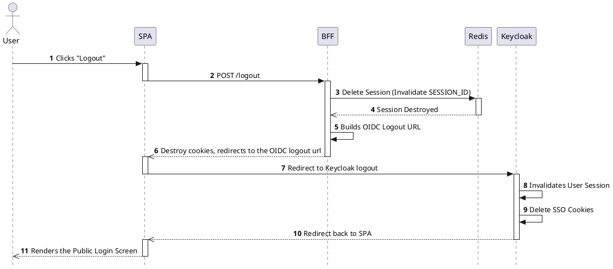

# Architecture with BFF (Backend For Frontend)

Before starting to write the code, it is essential to understand the architecture we are going to implement and the role of each element in the application.

--- 

### What is a BFF and why do we need it?

Imagine you are building a system. In the beginning, life is simple: you have one server (a **Monolith**) and one Frontend (the website). They talk to each other easily.

However, as systems grow, things get messy:

* **Complexity:** Instead of one big program, we break the logic into smaller, specialized pieces called **Microservices**.
* **Security is hard:** If your Frontend (the browser) tries to talk to all these microservices directly, it has to manage complex security tokens for each one.
* **Information Overload:** A mobile app might only need a user's name, but a general server might send the full profile (address, history, bio), wasting data and battery.

> [!Caution]
> Storing sensitive Access Tokens directly in the browser is dangerous because hackers can steal them more easily via scripts.

### The Solution: The BFF (Backend For Frontend)

The **BFF** sits between your Frontend and the complex internal services.

* **The Translator:** Instead of the Frontend calling five different services, it calls only the BFF. The BFF gathers all the data, cleans it up, and sends back exactly what the UI needs.
* **The Vault:** The BFF handles the "heavy" security (Keycloak). It stores critical tokens in a safe place (**Redis**) and only gives the browser a simple "Session Cookie".

> [!IMPORTANT]
> **In short:** The BFF simplifies the Frontend's life and keeps the secret keys safe under lock and key.

### Microservices Architecture

In a **Monolithic** architecture, the entire application—database, security, and logic—runs as a single unit. If one part fails, the whole system goes down.

**Microservices** break this unit into small, independent services that communicate over a network.

* **Independence:** Each service (like Keycloak for auth or Redis for sessions) handles one specific task.
* **Scalability:** You can update or restart the "Security Service" without affecting the "Payment Service".
* **Communication:** Services use protocols like HTTP or gRPC to exchange data.

*Tradicional Architecture*

*BFF Architecture*

### Stateless and Stateful Applications

Understanding how a program manages data is crucial for architecture design.

##### Stateless Applications

A **Stateless** program does not "remember" previous interactions.

* **Isolation:** Each request from the client must contain all the information necessary for the server to understand and process it.
* **Benefit:** Since the server doesn't store data between requests, it is very easy to scale. You can have 100 identical servers, and the client can talk to any of them.

#### Stateful Applications

A **Stateful** program remembers the history of the interaction.

* **Memory:** The server keeps track of the client's state (e.g., "the user is logged in" or "there are 3 items in the shopping cart").
* **Context:** The server uses data from previous requests to process the current one.
* **Our Project:** Our BFF is **Stateful**. It uses **Redis** to remember your security tokens. When you send a request, the BFF looks at your "Session ID" and retrieves your data from its memory (Redis).

> [!TIP]
> **Why combine them?**
> We often use **Stateless** microservices for business logic because they are fast and scalable, but we use a **Stateful** BFF to manage security and keep the user's "session" alive without making the Frontend complex.

---

## Keycloak

In this architecture, **Keycloak** is not just a login page; it is the "Identity Provider." Its job is to verify who the user is and issue the "Keys" ([Tokens](#jwt)) that allow access to the system.

**Keycloak** acts as the central security authority. Instead of our application handling passwords or permissions directly, we delegate those responsibilities to Keycloak to ensure a professional and secure standard.

### Identification (Who are you?)

The first and most basic role of Keycloak is **Authentication**. It serves as the single source of truth for user identities.

* **Centralized Login:** Keycloak provides a secure, pre-built login page, meaning our application never touches or "sees" the user's password.

* **Identity Management:** It stores user profiles, such as names and emails, and verifies that the person logging in is exactly who they claim to be.

* **Single Sign-On (SSO):** You have one electronic badge. You swipe it at the main entrance, and from that moment on, all the other apps recognize you and open automatically.

    SSO allows a user to log in once to a central authority (Keycloak) and gain access to multiple independent systems without being asked for their password again.

### Authorization (What can you do?)

It determines what parts of the system the user is allowed to access.

Once Keycloak knows who the user is:

* **Role Management:** Keycloak can assign specific "Roles" to users (for example, `ADMIN` or `USER`).
* **Access Control:** When the BFF requests information, Keycloak attaches these permissions to the security token.

> [!Caution]
> The Keycloak doesnt know what parts of the systems the user is allowed to access. This logic is handled by our application.  

### OAuth 2.0

**OAuth 2.0** is the industry-standard protocol for **authorization**. It is the set of rules that allows our BFF to obtain permission to access the user's data without ever seeing the user's password.

##### OAuth2.0 Core Concept

Instead of giving keys permanent, you give our user a **temporary access card** that only opens the guest room for 24 hours.

##### OAuth 2.0 Flow

To understand the flow, you must recognize these four roles:

1. **Resource Owner:** The **User**. They own the data and give permission to access it.
2. **Client:** Our **BFF application**. It is the software requesting access to the user's account.
3. **Authorization Server:** **Keycloak**. This is the engine that verifies the user and issues the tokens.
4. **Resource Server:** The **Backend/API** that holds the data. It only shares information if the Client presents a valid token.

> [!NOTE]
> **Important Distinction:**
> * **Authentication (OpenID Connect):** Proves **who** you are (Identity).
> * **Authorization (OAuth 2.0):** Defines **what** you are allowed to do (Permissions).
> Keycloak handles both at the same time.

---

### OpenID Connect (OIDC)

While **OAuth 2.0** handles permissions, **OpenID Connect (OIDC)** is a thin layer on top of it that handles **Identity**. It allows the BFF to verify the identity of the user based on the authentication performed by Keycloak.

### Why OIDC?

OAuth 2.0 was designed to give access to data, but it doesn't tell the application *who* the user is. OIDC extends OAuth 2.0 to provide this missing information through a specific type of token called the **ID Token**.

### The Difference in Practice

* **OAuth 2.0:** Gives the BFF an **Access Token** to call a backend API ("I have permission to read this file").
* **OIDC:** Gives the BFF an **ID Token** to know who is logged in ("The user is John Doe, and his email is john@example.com").

> [!TIP]
> **Further in the tutorial:**
> When you see the `@AuthenticationPrincipal OidcUser` annotation in your Spring Controller, you are using OIDC to display the user's name and email on the screen.

---

## Redis

In this architecture, *Redis* is used as a high-performance data store to manage the state of user sessions. It acts as the bridge between the authentication provided by Keycloak and the requests made by the Frontend.

### What is Redis

Traditional microservices are often stateless. However, a BFF using the Token Handler Pattern needs to store security information securely on the server side.

- In-Memory Storage: Redis stores data in RAM, allowing the BFF to retrieve tokens with sub-millisecond latency during every HTTP request.

- Token Abstraction: Instead of sending the Access Token, Refresh Token, and ID Token to the browser, the BFF stores these objects in Redis.

### The Session-to-Token Mapping

The core function of Redis in this system is to map a simple identifier to a complex security context:

- **Storage:** When Keycloak returns the tokens after a successful login, the BFF creates a unique Session ID.

- **Indexing**: The BFF saves the tokens in Redis, using the Session ID as the primary key.

- **Cookies**: The BFF sends only the Session ID to the browser via a secure, HTTP-only cookie.

- **Retrieval**: For every subsequent request, the BFF reads the cookie, queries Redis for the associated tokens, and uses them to authorize the request to backend services.

### Security and Lifecycle

Using Redis provides specific technical advantages for session control:

- **Session Revocation:** If a user logs out or a security threat is detected, the BFF simply deletes the entry in Redis. This immediately invalidates the browser's session without waiting for a token to expire.

- **TTL (Time To Live):** Every entry in Redis is configured with an expiration time. This ensures that inactive sessions are automatically purged from memory, maintaining system efficiency.

- **Data Isolation:** Since the browser never handles the tokens directly, the risk of Cross-Site Scripting (XSS) attacks stealing credentials is significantly reduced.

> [!Important]
> **Summary:** Redis allows the BFF to implement the Stateful BFF pattern. It keeps sensitive tokens on the server side and manages the session lifecycle through high-speed, key-value mapping.

---

# About Tokens and IDs

## JWT

A JWT (JSON Web Token) is compact way to securely share information between two parties, typically a client and a server. In our architecture, it is issued by Keycloak (the Identity Provider) after successfully authenticating a user's credentials.

In our architecture, the BFF (Backend-for-Frontend) uses this token whenever it needs to access the Backend. The BFF attaches the JWT to the request header as follows: `Authorization: Bearer <token>`.

The Backend receives the token, validates its signature, and identifies the user immediately.

##### About JWT structure:
A JWT consists of three parts: the Header, the Payload, and the Signature, separated by dots.
* **Header:** Tells the receiving system how to read and process the token. It typically contains:

  * **typ (Type):**  Type of token (JWT).

  * **alg (Algorithm):** The algorithm used to create the signature. 

* **Payload:** Contains the Claims. These are the user data fields, such as username, roles, realms, and expiration time.
* **Signature:**
Ensures the token was not tampered with during transit between Keycloak and your application.

##### How it Works

1) **Generation:** Keycloak takes the Header and the Payload.

2) **Signing:** It uses a Private Key (known only to Keycloak) and the algorithm specified in the Header to generate a unique hash.

3) **Validation:** When your application receives the token, it uses Keycloak’s Public Key to verify if the signature matches the content. If the data was changed by even a single character, the signature becomes invalid.

#### Example

## IDs

An ID is simply a cryptographically secure random string of characters. Unlike a JWT, an ID does not contain any data within itself. It acts purely as a pointer, a reference, or a "claim check" ticket.

In our architecture, the BFF generates a Session ID (using Spring Session and Redis) and sends it to the Frontend (Vue.js) via a secure, `HttpOnly` cookie. Because it contains no data, it is useless to an attacker trying to decode it, and the frontend cannot extract user information from it.

##### How it Works

1) **Generation:** When a user authenticates, the server (BFF) generates a random, unique string (the ID).
2) **Storage:** The server saves the user's sensitive data (like the Keycloak JWTs, user roles, and security context) into a database, in our case, **Redis**. It uses the generated ID as the primary key for this data.
3) **Delivery:** The server sends only the ID back to the client's browser as a Cookie.
4) **Validation:** On every subsequent request, the browser sends the ID back to the server. The server must query Redis using this ID to retrieve the actual user data and JWTs. If the ID is not found in Redis, the session is considered invalid or expired.

---

## Token vs. ID: What is the difference?

To summarize the core architectural difference:

| Feature | JWT (Token) | ID |
| :--- | :--- | :--- |
| **Data Storage** | Contains the actual user data inside its payload. | Contains absolutely no data. |
| **Validation** | Mathematically validated using cryptographic public keys. | Validated by querying a database. |
| **Database Lookup** | Not required (Stateless). | Mandatory on every request (Stateful). |
| **Where we use it** | Between the BFF and the Backend API. | Between the Frontend (Vue) and the BFF. |

---

## The Anatomy of a BFF Session

When a user successfully logs in, our architecture handles an ecosystem of **five distinct tokens and IDs**. 

### From Keycloak 
When the BFF authenticates with Keycloak, it receives three distinct JWTs:

* **1. ID Token:** A JWT focused on answering *"Who is this user?"*.
  * **Contents:** User profile data (name, email, preferred username).
  * **Usage:** The BFF uses this to extract the user's name to display on the frontend screen. It is **never** sent to the Backend API.
* **2. Access Token:** A JWT focused on answering *"What is this user allowed to do?"*.
  * **Contents:** Permissions, Roles (e.g., `ROLE_USER`, `ROLE_ADMIN`).
  * **Usage:** The BFF injects this token into the `Authorization: Bearer <token>` header every time it makes a request to our Resource Server (Backend 8082).
 * **3. Refresh Token:** A long-lived token (it needs to be more than the others).
   * **Usage:** When the short-lived Access Token expires, the Spring Boot BFF automatically catches the error, sends the Refresh Token to Keycloak in the background, and requests a brand new Access Token. The user remains logged in without noticing anything.

### From BFF 
Because of the BFF pattern rules, **the browser cannot have access to the Keycloak JWTs**. So, what does the BFF send to the frontend?

* **4. SESSION ID:**  An string generated by the BFF.
  * **Usage:** The BFF takes the 3 Keycloak JWTs mentioned above, serializes them, and locks them inside **Redis**. It then sends the Session ID to the browser inside an `HttpOnly` cookie. The browser automatically attaches it to every request made to the BFF. The BFF then goes to Redis, presents this ID, Redis retrieve the saved Access Token, and BFF uses it to communicate with the API.
* **5. XSRF-TOKEN:** A secondary cookie sent by the BFF to prevent Cross-Site Request Forgery (CSRF) attacks.
  * **Usage:** Because our frontend relies on cookies for the session, a malicious site could trick the browser into sending those cookies. To prevent this, the BFF sends the `XSRF-TOKEN` cookie which is attached to a custom HTTP Header (`X-XSRF-TOKEN`) on every POST/PUT/DELETE request. The BFF checks if the header matches the cookie. A hacker's site cannot read the cookie, so it cannot forge the header, making the attack impossible.

### What exactly goes into Redis?

If you inspect the Redis database during an active session (using the `HGETALL` command), you will find the Session ID linked to a massive block of serialized binary data. 

This is the **Java Object Serialization** of the Spring `SecurityContext`. 
Redis acts as an extension of the BFF's RAM. Inside that binary block, Spring securely stores the user's email, name, and **the actual Keycloak JWTs**. When the user makes a request with their Session ID cookie, the BFF fetches this binary block from Redis, deserializes it, extracts the Access Token, and forwards the request to the Backend API.

---

## Application Lifecycles (Sequence Diagrams)

Now that we understand the tokens, let's visualize how they flow through the system in everyday scenarios.

### 1. First Login from user

The diagram below simulates what happens when a new user has the first contact with the system.

### 2. Successful API Request

This is what happens when a logged-in user with authorization clicks a button to fetch data from the backend (API).

### 3. Access Token expired Path

This is what happens when a users Access Token expires, and BFF handle it Server to Server with Keycloak using the Refresh Token.

### 4. Access Token and Refresh Token expired path 

This is what happens when both Access and Refresh token expires, including the SSO Cookies.

> [!Note] The SSO Rescue Scenario (No Credentials Login)
> Even if both of your tokens (Access and Refresh) expire in the BFF, Keycloak supports SSO (Single Sign-On). When you initially log in with your credentials, Keycloak saves a secure, HttpOnly Session Cookie (named `KEYCLOAK_IDENTITY`) directly in your browser. 
> 
> This Cookie is an encrypted session identifier exclusively managed by Keycloak. It must has a longer lifespan than your Access And Refresh Tokens. If this SSO cookie is still active when the BFF redirects you to Keycloak, Keycloak will recognize it, **skip the login screen entirely**, and immediately redirect you back to the BFF with a fresh Authorization Code.
> If the SSO Cookie is also expired (or manually deleted),the user faces a **Full Re-login**, which requires typing their credentials again just like the flow implemented above.

### 5. Logout from User

When a user makes a request for Logout, the system goes through the following path:

---

References:

[BFF Architecture](https://samnewman.io/patterns/architectural/bff/)

[tokens](https://blog.elest.io/keycloak-token-management-expiration-revocation-and-renewal/)

[oicd logout](https://docs.spring.io/spring-security/reference/reactive/oauth2/login/logout.html)

