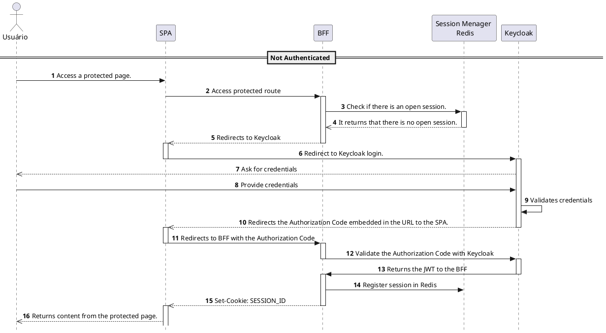
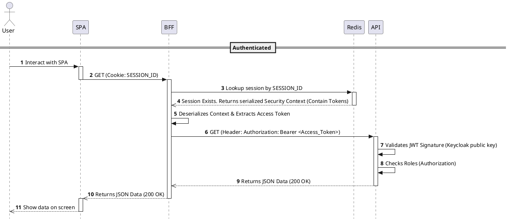
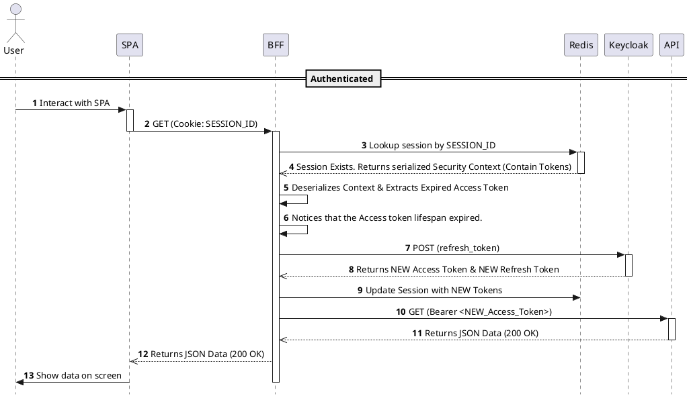
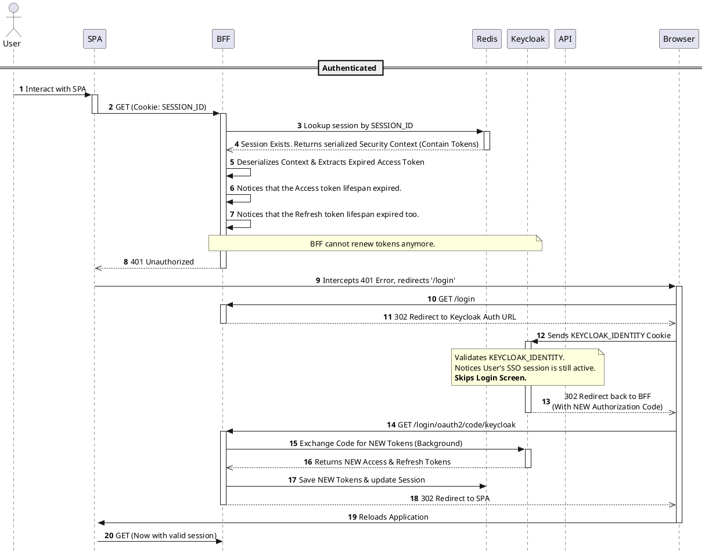

# Architecture with BFF (Backend For Frontend)

Before starting to write the code, it is essential to understand the architecture we are going to implement and the role of each element in the application.

> [!Note] Keycloak 
> An open-source identity and access management platform responsible for handling authentication for the entire project.

> [!Warning] Redis 
> This in-memory database will be used to store the JWT (the Access Token provided by Keycloak after a successful user authentication).

> [!Important] BFF (Backend For Frontend) 
> A fundamental component in the security architecture, acting as an intermediary between the Backend (API), the Frontend, and Keycloak.

## Architecture

When the user accesses a protected page, the BFF (through the Controller class) redirects the user to Keycloak for login. After successful authentication, it receives the JWT and stores it in Redis, generating a random session ID in return, which is sent to the frontend via secure cookies. This ensures that the browser never handles the real token, preventing XSS attacks. On subsequent requests, the BFF simply exchanges this session ID for the original JWT to authenticate requests against the internal microservices.

Check out the architectural structure below:

---

# About Tokens and IDs

## JWT

A JWT (JSON Web Token) is a JSON object issued by Keycloak (the Identity Provider) after successfully authenticating a user's credentials.

A JWT consists of three parts: the Header, the Payload, and the Signature. In our architecture, the BFF (Backend-for-Frontend) uses this token whenever it needs to access the Backend. The BFF attaches the JWT to the request header as follows: `Authorization: Bearer <token>`.

The Backend receives the token, validates its signature, and identifies the user immediately—eliminating the need to query the database (Redis) for user identity on every request.
Important 

#### About JWT structure:
* **Header:** Tells the receiving system how to read and process the token. It typically contains:
  * **Contents:** User profile data (name, email, preferred username).

  * **typ (Type):**  The type of object.

  * **alg (Algorithm):** The hashing algorithm used to create the signature.

* **Payload:** Contains the Claims. These are the user data fields, such as username, roles, realms, and expiration time.
* **Signature:**
Ensures the token was not tampered with during transit between Keycloak and your application.

#### How it Works

1) **Generation:** Keycloak takes the Header and the Payload.

2) **Signing:** It uses a Private Key (known only to Keycloak) and the algorithm specified in the Header to generate a unique hash.

3) **Validation:** When your application receives the token, it uses Keycloak’s Public Key to verify if the signature matches the content. If the data was changed by even a single character, the signature becomes invalid.

#### Example

## IDs

An ID is simply a cryptographically secure random string of characters. Unlike a JWT, an ID does not contain any data within itself. It acts purely as a pointer, a reference, or a "claim check" ticket.

In our architecture, the BFF generates a Session ID (using Spring Session and Redis) and sends it to the Frontend (Vue.js) via a secure, `HttpOnly` cookie. Because it contains no data, it is useless to an attacker trying to decode it, and the frontend cannot extract user information from it.

#### How it Works

1) **Generation:** When a user authenticates, the server (BFF) generates a random, unique string (the ID).
2) **Storage:** The server saves the user's sensitive data (like the Keycloak JWTs, user roles, and security context) into a database, in our case, **Redis**. It uses the generated ID as the primary key for this data.
3) **Delivery:** The server sends only the ID back to the client's browser as a Cookie.
4) **Validation:** On every subsequent request, the browser sends the ID back to the server. The server must query Redis using this ID to retrieve the actual user data and JWTs. If the ID is not found in Redis, the session is considered invalid or expired.

---

## Token vs. ID: What is the difference?

To summarize the core architectural difference:

| Feature | JWT (Token) | ID |
| :--- | :--- | :--- |
| **Data Storage** | Contains the actual user data inside its payload. | Contains absolutely no data. |
| **Validation** | Mathematically validated using cryptographic public keys. | Validated by querying a database. |
| **Database Lookup** | Not required (Stateless). | Mandatory on every request (Stateful). |
| **Where we use it** | Between the BFF and the Backend API. | Between the Frontend (Vue) and the BFF. |

---

## The Anatomy of a BFF Session

When a user successfully logs in, our architecture handles an ecosystem of **five distinct tokens and IDs**. 

### From Keycloak 
When the BFF authenticates with Keycloak, it receives three distinct JWTs:

* **1. ID Token:** A JWT focused on answering *"Who is this user?"*.
  * **Contents:** User profile data (name, email, preferred username).
  * **Usage:** The BFF uses this to extract the user's name to display on the frontend screen. It is **never** sent to the Backend API.
* **2. Access Token:** A JWT focused on answering *"What is this user allowed to do?"*.
  * **Contents:** Permissions, Roles (e.g., `ROLE_USER`, `ROLE_ADMIN`).
  * **Usage:** The BFF injects this token into the `Authorization: Bearer <token>` header every time it makes a request to our Resource Server (Backend 8082).
 * **3. Refresh Token:** A long-lived token (it needs to be more than the others).
   * **Usage:** When the short-lived Access Token expires, the Spring Boot BFF automatically catches the error, sends the Refresh Token to Keycloak in the background, and requests a brand new Access Token. The user remains logged in without noticing anything.

### From BFF 
Because of the BFF pattern rules, **the browser cannot have access to the Keycloak JWTs**. So, what does the BFF send to the frontend?

* **4. SESSION ID:**  An string generated by the BFF.
  * **Usage:** The BFF takes the 3 Keycloak JWTs mentioned above, serializes them, and locks them inside **Redis**. It then sends the Session ID to the browser inside an `HttpOnly` cookie. The browser automatically attaches it to every request made to the BFF. The BFF then goes to Redis, presents this ID, Redis retrieve the saved Access Token, and BFF uses it to communicate with the API.
* **5. XSRF-TOKEN:** A secondary cookie sent by the BFF to prevent Cross-Site Request Forgery (CSRF) attacks.
  * **Usage:** Because our frontend relies on cookies for the session, a malicious site could trick the browser into sending those cookies. To prevent this, the BFF sends the `XSRF-TOKEN` cookie which is attached to a custom HTTP Header (`X-XSRF-TOKEN`) on every POST/PUT/DELETE request. The BFF checks if the header matches the cookie. A hacker's site cannot read the cookie, so it cannot forge the header, making the attack impossible.

### What exactly goes into Redis?

If you inspect the Redis database during an active session (using the `HGETALL` command), you will find the Session ID linked to a massive block of serialized binary data. 

This is the **Java Object Serialization** of the Spring `SecurityContext`. 
Redis acts as an extension of the BFF's RAM. Inside that binary block, Spring securely stores the user's email, name, and **the actual Keycloak JWTs**. When the user makes a request with their Session ID cookie, the BFF fetches this binary block from Redis, deserializes it, extracts the Access Token, and forwards the request to the Backend API.

---

## Application Lifecycles (Sequence Diagrams)

Now that we understand the tokens, let's visualize how they flow through the system in everyday scenarios.

### 1. Successful API Request

This is what happens when a logged-in user with authorization clicks a button to fetch data from the backend (API).

### 2. Access Token expired Path

This is what happens when a users access token expires.

### 3. Access Token and Refresh Token expired path 

This is what happens when both Access and Refresh token expires.

References:

[site1](https://blog.elest.io/keycloak-token-management-expiration-revocation-and-renewal/)

