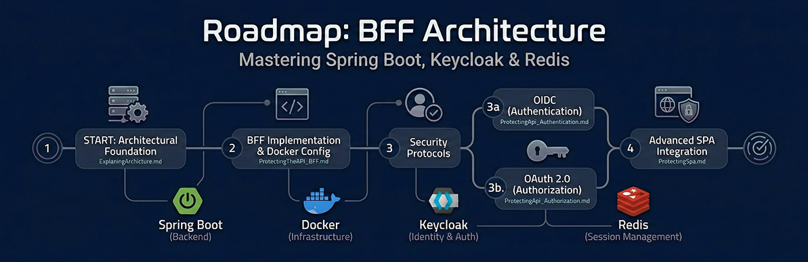

# :map: Roadmap: BFF Architecture & API Security

Welcome to the learning path for modern application security. In this module, you will learn how to build and implement a professional, distributed architecture using **Spring Boot**, **Keycloak**, and **Redis**.

---

### The Learning Journey

To master these concepts, follow the documentation in this specific order:

#### 1. The Architectural Foundation

This is the theoretical understanding of the ecosystem. Do not skip this section, as it holds the concepts you will apply in practice.

* **[ExplaningArchictureBFF.md](LearningPaths/ArchitectureBFFandKeycloak/ExplaningArchicture.md)**: An introduction to the **BFF (Backend For Frontend)** pattern. This file covers the difference between **Stateless** and **Stateful** systems and explains why microservices require this specialized layer.

#### 2. BFF Implementation

It is time to build the infrastructure and the code.

* **[ProtectingTheAPI_BFF.md](LearningPaths/ArchitectureBFFandKeycloak/ProtectingTheApi_BFF.md)**: The core practical tutorial. You will configure **Docker** (Keycloak, Postgres, and Redis) and build a Spring Boot application using `SecurityConfig` and a protected `BffController`.

#### 3. Understanding the Security Protocols

Learn the implementation of industry-standard security protocols to manage identity verification and resource protection across distributed systems.

* **[ProtectingApi_Authentication.md](LearningPaths/ArchitectureBFFandKeycloak/ProtectingApi_Authentication.md)**: Focused on **OIDC (OpenID Connect)**. Learn how the system verifies "who" the user is (Identity).
* **[ProtectingApi_Authorization.md](LearningPaths/ArchitectureBFFandKeycloak/ProtectingApi_Authorization.md )**: Focused on **OAuth 2.0**. Learn how the system defines "what" the user is allowed to do (Permissions/Scopes).

#### 4. Advanced Frontend Integration

How to apply these backend protections to modern client-side applications.

* **[ProtectingSpa.md](LearningPaths/ArchitectureBFFandKeycloak/ProtectingSpa.md)**: Learn how to connect a **Single Page Application (SPA)**—like React or Vue—to your BFF while ensuring that sensitive security tokens never leave the server.

---

### Key Technologies You Will Master

* **Architecture:** BFF (Backend For Frontend) & Microservices.
* **Identity & Auth:** Keycloak (OIDC & OAuth 2.0).
* **Infrastructure:** Docker & Docker Compose.
* **Session Management:** Redis (High-speed In-memory Database).

> [!TIP]
> **Pro-Tip for Students:**
> As you read, focus on how the **BFF** acts as a "security vault." Its main job is to keep complex tokens safe in **Redis** while giving the browser a simple, safe session cookie.
